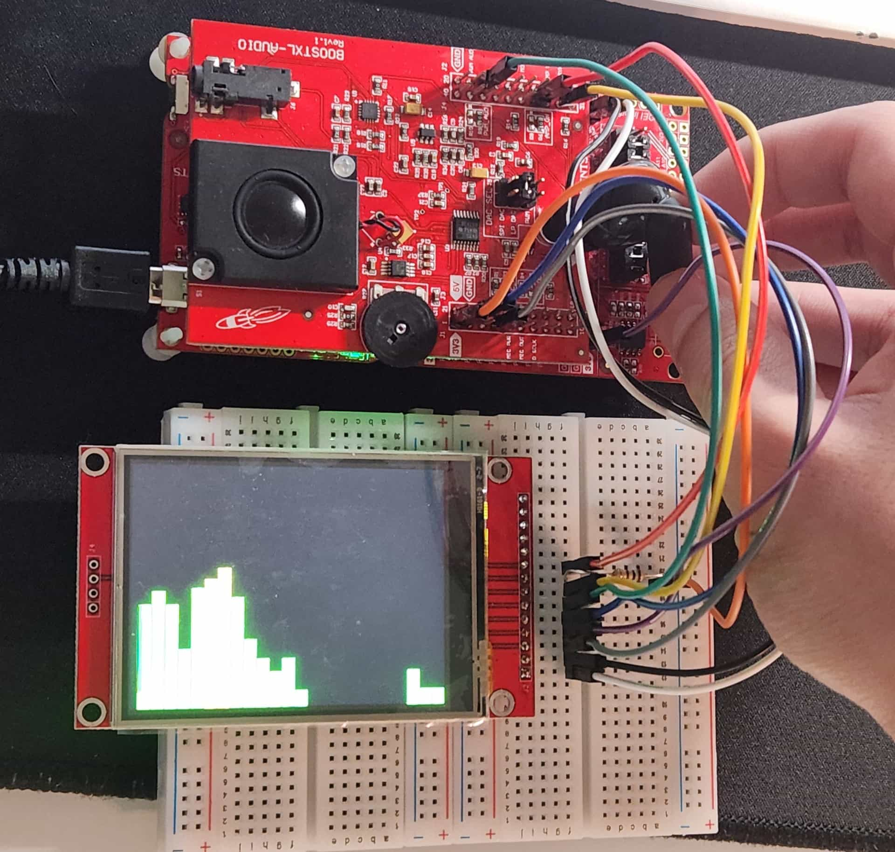

# Real-time Audio Spectrum Visualizer

This project is a real-time audio spectrum visualizer for an MSPM0G3507 LaunchPad attached with a BOOSTXL-AUDIO Boosterpack and ILI9341 TFT LCD.

## Hardware

- TI MSPM0G3507 LaunchPad
- BOOSTXL-AUDIO Boosterpack
- ILI9341 TFT LCD (COM-28379 Sparkfun)

## Current Features

- Audio sampling from the BOOSTXL-AUDIO's microphone using the MSPM0G3507's ADC and a HW timer.
- Microphone-to-speaker passthrough using HW interrupts to read and write audio samples from the ADC to DAC.
- Concurrent FFT processing and data capture using 1024-sample ping-pong buffers
- ILI9341 LCD spectrum display with configurable, logarithmically spaced bars across a configurable frequency range.

## Planned Features

- Integrate ESP32 Bluetooth audio input

## Build

Compile, load, and run the project from Code Composer Studio.

## AI Usage

AI assistance was used for debugging and generating boilerplate code, including driver-related code.
